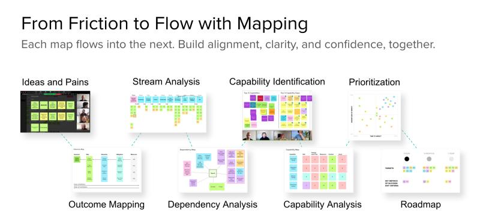

# Flow Engineering

A current full description of the original Flow Engineering framework for collaborative mapping is [published here](https://vzbl.io/flowengineering): https://vzbl.io/flowengineering

## History

Flow Engineering is a term that originated in fluid dynamics, but I began using it to refer to improving work, data, and information flow in early 2019. This history hopefully explains how it came into use and the thoughts and experience behind its origins. 
  \
  \
The first public use seems to be a talk submitted to All Day DevOps in 2019 (which wasn't accepted):

```
Flow Engineering - Boost velocity, quality and happiness in a few hours

How can you make time for real innovation and improvement? How do you know what to automate? How do you escape process prison? How can you get everyone aligned to make a difference? How can you show your team how much better things could be?

Flow Engineering builds on Value Stream Mapping as a framework of techniques you can use right now, with materials you already have - to discover opportunities, build and share your vision and save hours of toil every week so you can invest in what's next.

Sprinkle it on your:
- Delivery/Data/Testing/Analytics/Logging Pipeline
- Developer/Customer Onboarding
- Environment Provisioning
- Failure Recovery/Incident Management/Support Triage
- SDLC
- Toil/Process of choice, you get it :) \
…and start spending more time on what's next

I’ve started using Flow Engineering after years of struggling to find time for innovation, rally buy-in, optimize processes and communicate ideas, issues, and risks. It has helped me many times go from tearing my hair out (and I have the baldness to prove it!) to knowing exactly how to level up.

I structure the talk as a fun, story-based journey through enterprise IT, financial services, and a startup or two to share this powerful tool that gets incredible results. Attendees will get a link to all my materials and free examples to get started right away.
```

Soon after there was [this LinkedIn post](https://www.linkedin.com/posts/devopsto_flowengineering-activity-6575378115470610432-B9U0) and [tweet (1 like!)](https://twitter.com/SteveElsewhere/status/1169615636290519042?s=20) requesting feedback on the idea.

### 4 Maps

Initially, Flow Engineering was just a way I referred to my style of creating and applying simple value stream maps (initially called The Visible Value Delivery Program in 2018), and eventually grew to incorporate 3 more primary maps as well as ultimately a roadmap for improvement implementation.
  \
  \
The first addition was capability mapping, to address the constraints revealed through value stream mapping by providing a way for teams to break down the specific capabilities related to current constraints, giving more insight into what may be potential causes and solutions. After capability mapping provided a way to examine constraints inside the stream, dependency mapping provided a simple way to reveal and analyze constraints seemingly outside the stream. Outcome mapping was the last to appear after I had some trouble getting teams to clarify a single goal for the mapping process. Outcome mapping became a way to take many ideas, narrow them down, and then pick a leader which was broken down and analyzed to align the team.
  \
  \
It became associated with all 4 maps: Outcome, Value Stream, Dependency and Capability in late 2020 in a series of LinkedIn posts to get feedback on the idea.
  \
  \


  \
  \
In December 2020, the [4x4 Method of DevOps](https://vzbl.io/4x4) was created as a way to present all four maps in full context, and connect them as a way to make progress towards the 4 Key Metrics of DevOps from DORA.
  \
  \
Early in 2021, the Flow Roadmap arose as a tool to leverage all of the insights and action items that arose from the 4 maps and put them into a familar, actionable frame that teams could take away and use to guide their progress. After creating the maps with teams, I'd create a report with suggested action items for teams to execute, but nothing they could own themselves and work through. The Flow Roadmap became a way to deliver those results in collaboration with the team along with defined time horizons that allowed for a 'first-things-first' approach.
  \
  \


### Flow Engineering Game
We have created a Random Number Generator to create sample timing for the Flow Engineering game. It generates numbers for an 8-step process with 7 waiting steps in between.
We've published this [live on PyScript](https://abd3721.pyscriptapps.com/flow-engineering-timing-generator/) (not sure whether this will live forever or not).
You can also [find the code here](flow_engineering_timing_generator.py)

## Future

Since then, it's been adopted by [others](https://xodiac.ca/services/flow-engineering) who are now [contributing to its direction and evolution](https://flowcollective.org), which is the reason for creating this repo to capture and foster the practices and resources that can help teams leverage techniques to improve the flow of value through organizations. 
  \
  \
In Q2 2021, the 4x4 ebook was adapted to focus on flow engineering and published as an ebook with that title, [available here](https://vzbl.io/flowengineering) at https://vzbl.io/flowengineering
  \
  \
The hope is that through this repo and the efforts of the [Flow Collective](https://flowcollective.org), Flow Engineering becomes an accessible, actionable framework to introduce the value of mapping as way to reveal, clarify, align, measure, and improve flow in organizations everywhere.
